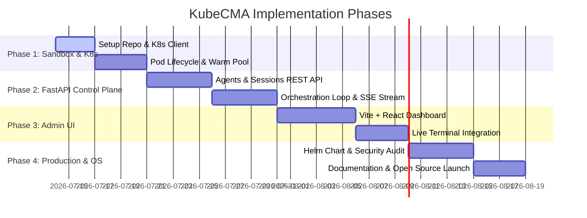

# Architecture & Implementation Plan: KubeCMA (Kubernetes Claude Managed Agents)

KubeCMA is a high-performance, enterprise-grade, open-source execution backend and standalone orchestrator for Claude Managed Agents running on Kubernetes.

---

## 1. Executive Summary & Open Source Strategy

### The Vision
As AI agents move from simple chat scripts to autonomous operators (executing commands, editing files, and browsing the web), security, observability, and infrastructure cost become paramount. 
- **Cloudflare's implementation** (`cloudflare/claude-managed-agents`) provides an excellent reference for edge and MicroVM runtimes, but enterprise environments are built on **Kubernetes**.
- **KubeCMA** bridges this gap by providing a Kubernetes-native agent execution layer and a standalone Anthropic-compatible control plane.

### Dual-Mode Architecture
To maximize open-source adoption and value, KubeCMA implements two operation modes:

1. **Bridge Mode (Execution Layer)**: 
   A direct replacement for Cloudflare's runtime. It receives webhooks from Anthropic's managed agent platform, claims the task, provisions an isolated Kubernetes Pod (sandbox), and streams tool execution results back to Anthropic.
2. **Standalone Mode (Self-Hosted Control Plane)**: 
   An open-source, API-compatible clone of the Anthropic Claude Managed Agents REST API (`/v1/agents`, `/v1/sessions`). It runs the orchestration loop in FastAPI, calls the Messages API directly, and executes tools inside local Kubernetes sandboxes. This allows organizations to run agents completely private to their network.

```mermaid
graph TD
    Client[Client App / SDK] -->|API Calls: /v1/agents, /v1/sessions| FastAPI[KubeCMA FastAPI Control Plane]
    Anthropic[Anthropic Platform] -->|Webhooks / Polling| FastAPI
    
    FastAPI -->|DB Operations| PostgreSQL[(PostgreSQL / SQLite)]
    FastAPI -->|Session State / SSE| Redis[(Redis / PubSub)]
    
    FastAPI -->|K8s API: Create / Manage Pods| K8s[Kubernetes Cluster]
    
    subgraph K8s Namespace "agent-sandboxes"
        PodA[Sandbox Pod A]
        PodB[Sandbox Pod B]
        PodC[Sandbox Pod C]
    end
    
    FastAPI -.->|Execute Tools: exec / gRPC / HTTP| PodA
    FastAPI -.->|Execute Tools: exec / gRPC / HTTP| PodB
    
    subgraph Observability
        Prom[Prometheus Metrics]
        Loki[Loki/Fluentbit Logs]
    end
    
    K8s --> Prom
    K8s --> Loki
```

---

## 2. Technical Architecture & System Design

### 2.1 The Control Plane (FastAPI Backend)
The backend is built in **Python 3.11+ using FastAPI**, providing a highly concurrent, async-first engine.

- **FastAPI Router**: Maps both Anthropic-compatible REST paths and operation hooks.
- **State Management**: SQLAlchemy (async) with a PostgreSQL backend (production) or SQLite (local development).
- **Task Queue / State Sync**: Redis for tracking session events, managing PubSub for Server-Sent Events (SSE) streaming, and coordinating pod pools.
- **Kubernetes Client**: `kubernetes_asyncio` library to interact with the Kubernetes API server asynchronously.

### 2.2 The Sandbox Environment (Kubernetes Pods)
Instead of Cloudflare Workers or MicroVMs (Firecracker), KubeCMA targets **Kubernetes Pods** as the sandbox unit.

#### Sandbox Lifecycle
1. **Warm Pool Provisioning**: To reduce startup latency (targeting <100ms), a controller maintains a pool of pre-warmed, paused, or idle pods.
2. **Session Binding**: When a session starts, a warm pod is claimed, updated with session metadata, and assigned network access.
3. **Execution**: The FastAPI backend executes tools inside the Pod.
4. **Pruning & Teardown**: Upon session termination or timeout, the Pod is deleted, and its volume is wiped.

```
[Warm Pool Manager] ---> Maintains N Idle Pods (ubuntu-agent-base)
                             |
                        (Session Starts)
                             v
[Control Plane] --------> Claims & Configures Pod (Injects Egress/Secrets)
                             |
                      (Executes Tools)
                             v
[Execution Engine] -----> runs bash/python commands via websocket-exec
                             |
                        (Session Ends)
                             v
[Tear Down] ------------> Deletes Pod & Cleans Volumes
```

#### Sandbox Security & Hardening
Kubernetes environments require rigorous security boundaries to prevent container escapes:
- **Non-Root Execution**: Pods run with UID 1000, `allowPrivilegeEscalation: false`, and read-only root filesystems where possible.
- **Resource Constraints**: Strict limits on CPU (e.g., 0.5 Core) and Memory (e.g., 512MB) per pod.
- **Network Isolation**: Default-deny `NetworkPolicies`. Only allowed egress paths are enabled (e.g., DNS, and explicit proxy targets).
- **Ephemeral Storage**: Using `emptyDir` or local ephemeral volumes to ensure data is completely destroyed when the Pod is deleted.
- **Egress Proxy**: An outbound proxy sidecar injected into the sandbox Pod. It implements egress rules (domain whitelisting) and injects API credentials/tokens on the fly, preventing the agent from seeing raw secrets.

---

## 3. REST API Specifications

KubeCMA replicates Anthropic's endpoints. All compatible endpoints require the standard beta header: `anthropic-beta: managed-agents-2026-04-01`.

### 3.1 Agents API
Used to define the agent persona, model, system instructions, and registered tools.

| Endpoint | Method | Description |
| :--- | :--- | :--- |
| `/v1/agents` | `POST` | Create a new agent configuration |
| `/v1/agents/{agent_id}` | `GET` | Retrieve details of an agent configuration |
| `/v1/agents/{agent_id}` | `DELETE`| Archive / delete an agent configuration |
| `/v1/agents` | `GET` | List agent configurations |

#### Request Payload (`POST /v1/agents`):
```json
{
  "name": "Kubernetes Administrator",
  "model": "claude-3-5-sonnet-latest",
  "system": "You are a Kubernetes expert. Use bash and kubectl to diagnose clusters.",
  "tools": [
    {
      "name": "bash",
      "description": "Execute terminal commands",
      "input_schema": {
        "type": "object",
        "properties": {
          "command": { "type": "string" }
        },
        "required": ["command"]
      }
    }
  ]
}
```

### 3.2 Sessions API
Used to run a specific instance of an agent session.

| Endpoint | Method | Description |
| :--- | :--- | :--- |
| `/v1/sessions` | `POST` | Create a new session for an agent |
| `/v1/sessions/{session_id}` | `GET` | Retrieve session status and metadata |
| `/v1/sessions/{session_id}/events` | `POST` | Send a user message or event to a session |
| `/v1/sessions/{session_id}/events` | `GET` | Stream session output (SSE) |

#### Response Event Stream (SSE format):
```
event: agent.message_start
data: {"message_id": "msg_123", "role": "assistant"}

event: agent.content_block_start
data: {"index": 0, "type": "text"}

event: agent.content_block_delta
data: {"index": 0, "delta": {"type": "text_delta", "text": "I am going to check..."}}

event: agent.tool_use
data: {"id": "tool_123", "name": "bash", "input": {"command": "kubectl get pods"}}

event: session.status_idle
data: {"session_id": "sess_456"}
```

---

## 4. Performance, Reliability & Observability (SRE)

### 4.1 Performance & Latency
- **Pod Pooling**: Keep 5-10 pre-warmed pods in the namespace. When a session initiates, rename the pod / attach labels. This drops start time from ~3s to <150ms.
- **WebSocket Shell**: Use Kubernetes WebSocket API (`/api/v1/namespaces/{ns}/pods/{name}/exec`) to keep execution channels open, avoiding the overhead of creating new SSH connections.

### 4.2 Reliability & Fault Tolerance
- **State Persistence**: The FastAPI backend stores agent state in PostgreSQL. If a pod crashes or is evicted, the control plane provisions a replacement pod, mounts the volume, and restores the agent loop seamlessly.
- **Heartbeats**: Periodic heartbeat checks between the FastAPI control plane and the sandboxed pods. If a pod becomes unresponsive, it is killed and rescheduled.

### 4.3 Observability
- **Structured JSON Logs**: Out-of-the-box support for Structured JSON logging.
- **Session Recordings**: Record all terminal input/output (like asciinema) and store them in object storage (MinIO/S3) for compliance and auditing.
- **OpenTelemetry**: Integrated tracing of API requests, LLM execution loops, and container execution times.

---

## 5. Operations & Admin UI

A sleek, dashboard UI is essential for tracking agent behaviors and cluster resources.

### Tech Stack
- **Frontend**: Vite + React.
- **Styling**: Vanilla CSS with custom properties (CSS variables) for theme support, glassmorphism dashboard layout, and smooth micro-animations.
- **Features**:
  - **Overview Dashboard**: Running sandboxes, token consumption, CPU/Memory utilization, and API throughput.
  - **Session Explorer**: Real-time terminal streaming of active agent sessions. Live view of tools being executed.
  - **Agent Manager**: Visual builder for creating and modifying agent configurations, prompt templates, and tool schemas.
  - **Security Console**: Review blocked egress domains, audit trails, and manage environment secrets.

```
+-----------------------------------------------------------------------+
|  KubeCMA  |  [Dashboard]   [Agents]   [Sessions]   [Security]  (Admin)|
+-----------------------------------------------------------------------+
|                                                                       |
|  ACTIVE SESSIONS (4)                       SANDBOX RESOURCE USAGE     |
|  +----------------------------------+     +------------------------+  |
|  | ID       | Agent     | Status    |     | CPU Usage:   [|||..]42%|  |
|  |----------|-----------|-----------|     | Memory:      [||||.]65%|  |
|  | sess_942 | K8sAdmin  | Running   |     | Warm Pods:   6 Available|  |
|  | sess_911 | WebSearch | Idle      |     +------------------------+  |
|  | sess_884 | DevBot    | Complete  |                                 |
|  +----------------------------------+     BLOCKED EGRESS LOGS         |
|                                           | 23:42:11 - blocked: hack.co|
|  LIVE TERMINAL (sess_942)                 | 23:45:04 - blocked: mine.org|
|  +-----------------------------------------------------------------+  |
|  | $ kubectl get pods                                              |  |
|  | NAME                     READY   STATUS    RESTARTS   AGE       |  |
|  | nginx-deployment-12345   1/1     Running   0          5d        |  |
|  |                                                                 |  |
|  +-----------------------------------------------------------------+  |
+-----------------------------------------------------------------------+
```

---

## 6. Open-Source Success Blueprint

To make KubeCMA a highly successful open-source project:
- **Developer-Centric Quickstart**: Support `docker-compose` and Local Kubernetes (`kind` / `minikube`) with a single command: `make dev`.
- **Helm Chart**: Provide a production-ready Helm Chart for instant deployment on AWS EKS, GCP GKE, and Azure AKS.
- **Documentation**: Write clear documentation with detailed tutorials on:
  1. Securing agent sandboxes with Linkerd/Istio or Calico NetworkPolicies.
  2. Integrating custom tools like browser-use or headless Playwright on K8s.
  3. Configuring egress filters to inject secrets without the agent's knowledge.
- **License**: Apache 2.0 or MIT for permissive enterprise adoption.

---

## 7. Phase-by-Phase Implementation Roadmap



### Phase 1: MVP Setup & K8s Sandbox Client
- Initialize git repo, setup Python project (Poetry/Pipenv, ruff, black).
- Implement `KubeSandboxClient` wrapping the Kubernetes asyncio API.
- Create Pod creation, command execution (exec websocket stream), and pod cleanup.
- Establish a local testing environment with `kind` or `minikube`.

### Phase 2: FastAPI Control Plane & Standalone Mode
- Implement the SQLite/PostgreSQL schemas for Agents and Sessions.
- Build standard REST endpoints matching Anthropic Managed Agents.
- Implement the Agent Orchestration Loop: Calls LLM, parses tool requests, directs tool run to the active `KubeSandboxClient`, and streams events using Server-Sent Events (SSE).
- Support webhook ingestion for Bridge Mode.

### Phase 3: Operations & Admin UI
- Setup React SPA with Vite.
- Design a high-fidelity dashboard (HTML/CSS) to monitor active pods, run logs, and session statistics.
- Implement a real-time web terminal (Xterm.js) attached to the active agent execution pod.

### Phase 4: Observability, Helm Charts & Launch
- Add Prometheus exporter and setup Loki log collection sidecar.
- Build the Helm Chart for multi-tenant production K8s deployment.
- Write README, Contribution Guidelines, and API manuals.
- Create a demo video/GIF for the GitHub repo.
