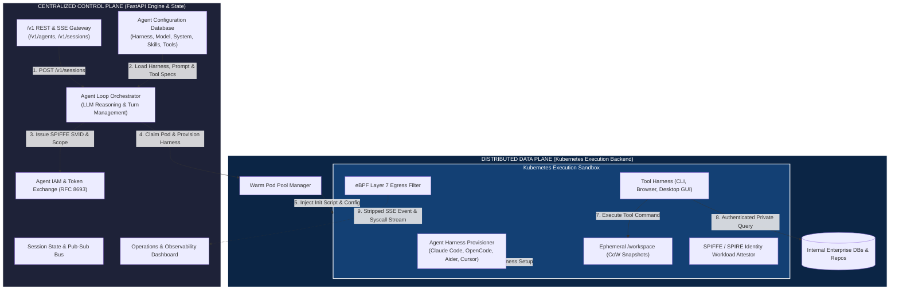
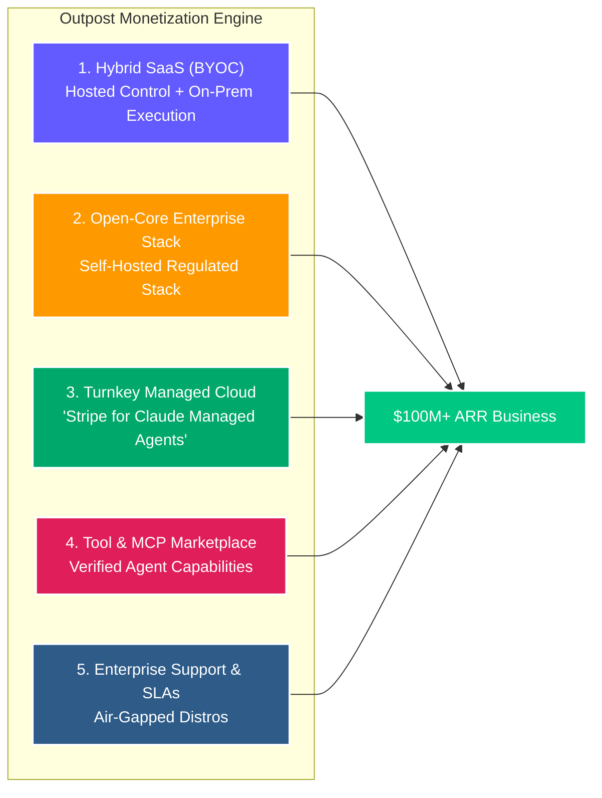
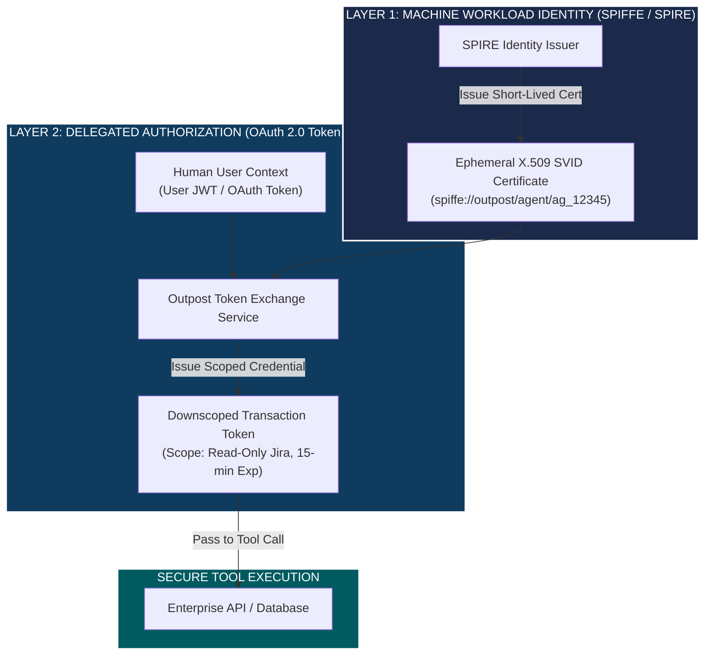
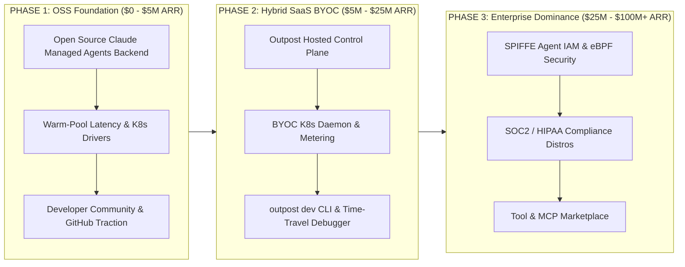

# Outpost Managed Agents: Open-Source Execution & Orchestration Backend for Claude Managed Agents ($100M+ ARR Strategy)

## 🌐 1. Executive Summary & Vision

As enterprise AI adoption transitions from basic chat completions to **autonomous agentic execution**, Anthropic introduced **Claude Managed Agents**—a landmark platform that manages the operational complexity of running AI agents (agent definition, tool calling, persistent multi-turn sessions, SSE streaming, and container sandboxing).

However, while **Claude Managed Agents** solves agent orchestration, enterprises face severe infrastructure and compliance boundaries when relying exclusively on cloud-hosted agent sandboxes:
1. **Data Gravity & Sovereignty**: Sensitive corporate source code, internal APIs, database records, and PII must not leave the enterprise's private cloud perimeter.
2. **Infrastructure Constraints**: Organizations need agents to execute tools inside their own private Kubernetes clusters with custom network policies, resource quotas, and local tool dependencies.
3. **Vendor Lock-In & Fixed Runtimes**: Organizations require an open-source, self-hosted alternative that implements the **Claude Managed Agents REST API specification** (`/v1/agents`, `/v1/sessions`) natively, while allowing full configurability of both the LLM reasoning model (**Bring Your Own Brain - BYOB**) and the coding agent runtime itself (**Bring Your Own Agent - BYOA**).

### The Outpost Solution: Open-Source Backend & Orchestration for Claude Managed Agents
**Outpost Managed Agents** is a production-grade, open-source execution backend and standalone orchestrator designed specifically for **Kubernetes** infrastructures. 

Outpost implements a **Dual-Mode Capability**:
* **1. Standalone Mode (Full Open-Source Orchestration Server)**: An API-compatible open-source clone of the **Claude Managed Agents** REST API (`/v1/agents`, `/v1/sessions`). Allows enterprises to host and run agents completely privately within their own network infrastructure.
* **2. Bridge Mode (Enterprise Execution Layer)**: Acts as a direct self-hosted backend replacement for Anthropic's hosted platform. Receives webhooks from Claude Managed Agents, provisions isolated sandboxes on local Kubernetes clusters, executes tools, and reports results back securely.

---

## 🏗️ 2. Architectural Decomposition: Control Plane vs. Data Plane

Outpost splits the agent's logic ("brain") from its execution environment ("hands"), separating the **Control Flow** from the **Data Flow**:



### Strategic Component Matrix

| Layer | Responsibilities | Security Scope | Monetization Leverage |
| :--- | :--- | :--- | :--- |
| **Control Plane** (Control Flow) | Claude Managed Agents API compatibility (`/v1/agents`, `/v1/sessions`), Agent Harness registry (Claude Code, OpenCode, Aider, Cursor), LLM turn orchestration, streaming SSE event bus, Agent IAM token exchange, dashboard UI. | **Low Risk** (Session metadata, harness configs, tool schema definitions, sanitized execution logs). | **High Margin SaaS**: Multi-tenant management console, BYOC control plane subscription, team access controls. |
| **Data Plane** (Data Flow) | Kubernetes pod provisioning, warm pool management, Harness dynamic init scripts, multi-modal tool execution (CLI, Headless Browser, Linux Desktop GUI), internal network boundaries. | **CRITICAL RISK** (Contains proprietary source code, secrets, database credentials, internal corporate data). | **Enterprise License / BYOC**: Per-node cluster licensing, microVM isolation modules, eBPF security add-ons. |

---

## 💼 3. Refined Business Model Taxonomy

Monetizing an open-source execution & orchestration backend for **Claude Managed Agents** provides five scalable revenue drivers:



### 1. Hybrid SaaS / Bring Your Own Cloud (BYOC) — *Core Growth Engine*
* **Concept**: Outpost hosts the Control Plane (Claude Managed Agents API router, session orchestrator, dashboard, observability). The enterprise deploys a lightweight agent runner in their own Kubernetes cluster.
* **Value Prop**: Enterprise developers get zero-ops management, while security teams ensure 100% of tool executions and code runs inside their private cloud perimeter.
* **Pricing**: Base platform subscription ($500–$2,500/month) + per-active-session-hour billing ($0.05 - $0.15/hour).

### 2. Commercial Open-Core (COSS) Enterprise Stack
* **Concept**: The core orchestrator and K8s sandbox driver are open-source (MIT). Enterprise-only compliance additions require a commercial license:
  * **Identity & IAM**: SPIFFE/SPIRE Workload Identity, OAuth 2.0 Token Exchange (RFC 8693), SAML 2.0 / OIDC.
  * **Governance**: eBPF L7 Egress Proxy, PII & Secret Redaction Engine, Immutable Session Audit Replay.
  * **Air-Gapped Operator**: Dedicated Helm/Kustomize packages for isolated networks.
* **Pricing**: Annual cluster subscription ($30,000 to $150,000+ per cluster/year).

### 3. Turnkey Managed Cloud ("Stripe for Claude Managed Agents")
* **Concept**: Fully managed hosted cloud API for AI startups and developers who want the Claude Managed Agents API experience without managing Kubernetes clusters.
* **Value Prop**: Instant deployment with global low-latency pre-warmed sandbox infrastructure.
* **Pricing**: Usage-based per vCPU/RAM second of sandbox execution time.

### 4. Verified Tool & Model Context Protocol (MCP) Marketplace
* **Concept**: A marketplace of pre-audited, secure tools and MCP servers (e.g., PostgreSQL, GitHub, Jira, web scrapers, OS desktop vision drivers).
* **Value Prop**: Developers import verified tools directly into their agent definitions (`tools: [...]`).
* **Pricing**: 70/30 revenue split on premium MCP server invocations.

### 5. Enterprise Support & Custom Appliance Distribution
* **Concept**: Custom distributions tailored for enterprise Kubernetes platforms (OpenShift, Rancher, Tanzu) backed by 24/7 SLAs.
* **Pricing**: $50,000 – $200,000/year enterprise support agreements.

---

## 🔬 4. Deep Technological Innovations Architecture

To maintain clear competitive dominance over raw sandbox providers and proprietary cloud offerings, Outpost introduces **five core innovation pillars**:

### 4.1 Configurable Agent Harness & "Bring Your Own Agent" (BYOA)

In addition to **Bring Your Own Brain (BYOB)**, Outpost introduces **Bring Your Own Agent (BYOA)**—allowing developers to explicitly configure the coding agent harness that runs inside the sandboxed environment:

```
+-----------------------------------------------------------------------------------+
| AGENT DEFINITION CONFIGURATION SCHEMA (`POST /v1/agents`)                         |
|                                                                                   |
|  * harness: "claude-code" | "opencode" | "aider" | "cursor-agent" | "custom"       |
|  * environment: { base_image: "...", init_script: "apt install -y ...", env: {} } |
|  * skills: ["git-workflow", "db-migration-verifier", "security-audit"]             |
|  * tools: [{ name: "bash", ... }, { name: "mcp_server", ... }]                    |
|  * agent_config: { cli_flags: "--dangerously-skip-permissions", config_files: {} }|
+-----------------------------------------------------------------------------------+
```

1. **Explicit Harness Drivers**:
   * **Claude Code Harness**: Pre-installs `ant` CLI / `@anthropic-ai/claude-code`, mounts `.claude.json` configurations, injects system prompts, and registers standard tools (`bash`, `write_file`, `read_file`).
   * **OpenCode Interpreter Harness**: Provisions Python-native OpenCode Agent environments with custom tool interpreters and multi-file editing capabilities.
   * **Aider / Cursor Agent Harness**: Configures Git-centric coding agents with automated commit tracking and LSP (Language Server Protocol) code indexing.
   * **Custom Agent Harness**: Allows developers to supply custom bash initialization scripts (`init_script`) and environment setup steps executed automatically upon sandbox container bootstrap.
2. **Dynamic Skills & Tools Injection**:
   * Outpost mounts skill definition folders (`.skills/`) and MCP servers directly into the sandbox file tree during pod initialization, allowing agents to ingest domain-specific capabilities on the fly.

---

### 4.2 Full-Stack Environment Checkpointing & Branching

Instead of merely saving conversation turn history, Outpost implements **Full-Stack OS & Environment Checkpointing**:

```
                                 [ STEP 10 CHECKPOINT ]
                              (OS State + Files + RAM + Browser)
                                      /              \
                                     /                \
          [ BRANCH A: Refactor Strategy ]          [ BRANCH B: Rebuild Strategy ]
          * Pod Sandbox A (Forked State)           * Pod Sandbox B (Forked State)
          * Test execution path 1                  * Test execution path 2
```

1. **Environment Branching & Parallel Execution**:
   * When an agent reaches a high-risk decision node (e.g., applying database migrations or writing complex code refactors), Outpost can fork the session into multiple parallel sandboxes.
   * Each branch inherits the exact memory state, running process tree, open network sockets, and filesystem snapshot. Outpost evaluates the branches, picks the winning outcome, and merges the winning state back into the main session.
2. **Instant Rewind & Time-Travel Debugging**:
   * If an agent encounters an error at Step 15, developers can instantly rewind the entire container state to Step 10 (restoring RAM, loaded Python libraries, and `/workspace` files) without re-running initialization steps.
3. **Agent Hibernation & Thawing**:
   * For human-in-the-loop approvals, active agent sandboxes are frozen via CRIU (Checkpoint/Restore in Userspace) and serialized to object storage (S3/Ceph). When approved, the sandbox thaws in **<100ms** on any cluster node.

---

### 4.3 Unified Agent & System Telemetry (Deep Observability)

Outpost bridges **LLM Cognition Metrics** with **Infrastructure System Metrics**:

```
+-----------------------------------------------------------------------------------+
| OUTPOST UNIFIED OBSERVABILITY DASHBOARD                                           |
|                                                                                   |
|  COGNITIVE TELEMETRY                   SYSTEM INFRASTRUCTURE TELEMETRY           |
|  --------------------                   ----------------------------------        |
|  * Prompt / Completion Tokens           * vCPU & RAM Usage Curves                 |
|  * Tool Choice Latency & Errors        * eBPF Syscall Trace Logs                  |
|  * Hallucination & Loop Index           * Disk I/O & Network Packet Rates         |
|  * Multi-Agent Parent/Child Tree        * Pod OOM & Throttling Flags              |
+-----------------------------------------------------------------------------------+
```

1. **Cognitive-Infrastructure Correlation**:
   * Correlates LLM reasoning slowdowns or looping behavior with underlying container resource constraints (e.g., identifying when an agent is failing a tool call due to memory throttling rather than prompt error).
2. **Agent Health & Hallucination Guardrails**:
   * Monitors real-time token burn velocity, tool error frequencies, and repetitive output loops, automatically interrupting runaway agent turns before wasting budget.
3. **OpenTelemetry-Native Distributed Tracing**:
   * Full end-to-end tracing across user applications, Outpost Control Plane, LLM model calls, sub-agent delegations, and sandbox container tool executions using standard OpenTelemetry context propagation.

---

### 4.4 Multi-Modal Compute Interfaces (CLI, Browser & Desktop OS)

Outpost expands sandbox execution beyond simple text-based bash commands to support **three compute interfaces**:

1. **Terminal & CLI Runtime**:
   * Ultra-fast, lightweight bash/Python/Node.js command execution inside isolated containers.
2. **Headless Browser Automation Runtime**:
   * Embedded Playwright/Puppeteer with Chrome DevTools Protocol (CDP) streaming. Agents can navigate web apps, solve forms, and capture DOM snapshots in authenticated browser states.
3. **Full Virtual Linux Desktop (OS / Computer Use)**:
   * Provisions a lightweight X11/Wayland virtual desktop environment (XFCE/KDE) running inside a K8s pod or microVM.
   * Exposes a VNC/noVNC framebuffer stream, allowing vision-language agents to control desktop GUI applications, legacy enterprise software, and desktop IDEs using native mouse and keyboard actions.

---

### 4.5 Developer Experience (DX) & Tooling Innovations

Developer experience is a primary driver of open-source adoption and platform stickiness. Outpost delivers a world-class DX suite:

```
$ outpost dev --agent-id ag_12345 --sync ./my-agent-code

[Outpost CLI] Connecting to Outpost Control Plane... Connected.
[Outpost CLI] Claimed warm sandbox pod: pod-agent-8f92a (Latency: 38ms)
[Outpost CLI] Establishing bi-directional sync for ./my-agent-code -> /workspace
[Outpost CLI] Live terminal stream open at http://localhost:8000/ui/sessions/sess_99823
[Outpost CLI] Watching for file changes... (Press Ctrl+C to disconnect)
```

1. **`outpost dev` Real-Time Local-to-Cluster Sync CLI**:
   * A developer CLI utility that establishes a live, bi-directional workspace sync (via WebSocket/rsync over mTLS) between a developer's local laptop directory and a remote Kubernetes sandbox pod.
   * Changes made in local IDEs (VS Code, Cursor) instantly reflect in the running agent sandbox without re-building containers or re-deploying code.
2. **Visual Step Tracer & Time-Travel Rewind UI**:
   * Built-in Operations Console UI displaying an interactive step-by-step timeline of agent turns.
   * Developers can inspect JSON payloads, tool inputs/outputs, system logs, and DOM snapshots at Step N, edit prompts or code locally, and click **"Replay from Step N"** to test fixes instantly.
3. **Universal LLM Adapter Driver ("Bring Your Own Brain" - BYOB)**:
   * Outpost natively supports Anthropic Claude Managed Agents while providing plug-and-play SDK drivers for OpenAI GPT-4o/Assistants, AWS Bedrock, Google Vertex AI, and local open-source LLMs (vLLM/Ollama).
4. **SDK & API Drop-In Compatibility**:
   * 100% drop-in client SDK compatibility (`anthropic.managed_agents` Python/TypeScript). Developers change `base_url="http://outpost:8000"` in their SDK initialization, retaining all existing agent codebase investments.

---

### 4.6 Agent Identity, Security & Delegation Protocols (Agent IAM)

Outpost implements an enterprise-grade **Two-Layer Agent Identity and Authorization Framework**:



1. **Layer 1: Workload Identity via SPIFFE/SPIRE**:
   * Every spawned sandbox pod is issued an ephemeral, cryptographically verifiable **SPIFFE ID (SVID x.509 certificate)**. This gives agents a true machine identity for Agent-to-Agent (A2A) authentication without static API keys.
2. **Layer 2: Delegated Authorization via OAuth 2.0 Token Exchange (RFC 8693)**:
   * When an agent acts on behalf of a human user, Outpost uses **RFC 8693 Token Exchange** to swap the user's high-privilege access token for a downscoped, short-lived, audience-restricted transaction token.
   * The agent operates strictly within the **permission intersection** of the user's rights and the agent's explicit tool boundary.
3. **Cryptographic Delegation Chains**:
   * When Parent Agent A delegates a task to Sub-Agent B, Outpost signs a cryptographic delegation chain, enforcing non-repudiation and preventing privilege escalation down the sub-agent hierarchy.
4. **eBPF Layer 7 Dynamic Egress Filtering**:
   * Attaches Cilium eBPF kernel probes to sandbox interfaces. Network egress is dynamically restricted to domain whitelists matching active tool definitions (e.g., allow `api.github.com` during git actions; drop all untrusted outbound packets).

---

## 📈 5. Path to $100M+ ARR: GTM Strategy & Revenue Phasing



### Detailed Revenue Milestones & Metrics

| Phase | Milestone Target | Key Revenue Drivers | Core Metrics |
| :--- | :--- | :--- | :--- |
| **Phase 1** (Months 1–12) | **$0 - $5M ARR** | Open-source adoption, developer self-service cloud tier, team subscriptions. | GitHub Stars (>5,000), Active Sessions (>250k/mo), Developer NPS. |
| **Phase 2** (Months 12–24) | **$5M - $25M ARR** | Expansion of Hybrid SaaS (BYOC) across mid-market tech companies, seat-based team UI licenses. | Net Revenue Retention (>130%), Active BYOC Clusters (>300). |
| **Phase 3** (Months 24–48) | **$25M - $100M+ ARR** | Six-figure enterprise contracts (Finance, Healthcare, Tech Giants), Security & Compliance add-ons, Marketplace rev-share. | Enterprise Accounts (>150 paying $100k+/yr), Gross Margin (>80%). |

---

## 🚀 Summary Action Plan for Outpost Codebase

To advance the Outpost codebase toward this vision:

1. **Configurable Agent Harness Schema (`app/models/agent.py`)**: Extend the Agent model to support `harness`, `environment` (init scripts, base images), `skills`, `tools`, and `agent_config`.
2. **Harness Provisioning Pipeline (`app/services/sandbox/`)**: Build dynamic initialization logic inside `direct.py` to inject harness setup scripts (`claude-code`, `opencode`, `aider`, `cursor-agent`) into sandbox containers upon boot.
3. **Control / Data Plane Decoupling**: Abstract session management so the FastAPI orchestrator can communicate with remote Kubernetes cluster daemons via gRPC/mTLS.
4. **Developer CLI (`outpost dev`) & Time-Travel Debugger**: Build a lightweight Python CLI package for workspace file syncing and visual step timeline rewinds.
5. **Agent IAM & Token Exchange**: Integrate SPIFFE/SPIRE workload attestation and OAuth 2.0 (RFC 8693) token downscoping into `app/services/orchestrator.py`.
