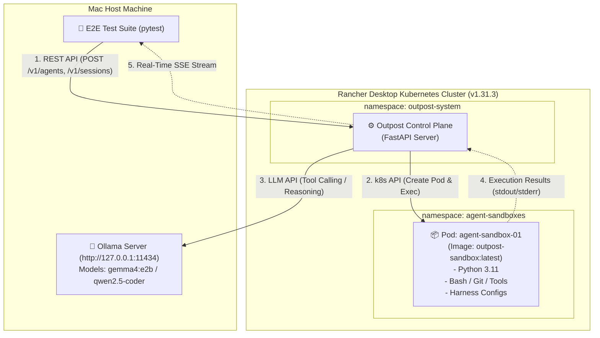

# 🚀 Real Kubernetes Cluster + Local Ollama E2E Testing Plan

> **Goal**: Replace mock/simulated end-to-end testing with a production-grade, real-world E2E test execution pipeline running against an actual Kubernetes cluster (**Rancher Desktop k3s**) and a local LLM inference engine (**Ollama**).

---

## 🏗️ Architecture & Component Flow

---

## 📋 Implementation Phases & Action Plan

### Phase 1: Sandbox Pod Docker Container & K8s RBAC Setup
1. **`docker/Dockerfile.sandbox`**: Create lightweight base sandbox image containing Python 3.11, bash, git, curl, tar, and CLI utilities required by coding harnesses (`claude-code`, `opencode`, `aider`).
2. **Build & Image Injection**: Build `outpost-sandbox:latest` and load into Rancher Desktop Docker containerd runtime.
3. **`deploy/k8s/` Manifests**:
   - `00-namespace.yaml`: Define `agent-sandboxes` and `outpost-system` namespaces.
   - `01-rbac.yaml`: ServiceAccount `outpost-controller`, ClusterRole, and ClusterRoleBinding for pod creation, exec, file transfer, and pod deletion.

### Phase 2: Ollama LLM Compatibility & Tool Calling Adapter
1. **Ollama Integration (`app/services/llm_adapter.py`)**:
   - Ensure Outpost's orchestrator can translate tool calls and messages between Anthropic `/v1/messages` format and Ollama `/v1/chat/completions` (OpenAI-compatible endpoint supported natively by Ollama at `http://localhost:11434/v1`).
2. **Model Selection**: Default to locally available `gemma4:e2b` or `qwen2.5-coder:7b`.

### Phase 3: Real Kubernetes Execution Driver Tuning (`DirectPodDriver`)
1. **`app/services/sandbox/direct.py`**: Verify in-cluster & out-of-cluster `kubeconfig` loading for Rancher Desktop (`~/.kube/config`).
2. **Exec & Command Streaming**: Ensure `WebSocket` stream exec commands cleanly execute inside real pods in `agent-sandboxes` namespace.

### Phase 4: Real E2E Test Suite Implementation (`tests/e2e/test_real_k8s_ollama_e2e.py`)
1. **Cluster Pre-flight Check**: Verify Rancher Desktop node status (`ready`) and Ollama health before running.
2. **Full Agent Lifecycle Execution**:
   - Register an Agent with `opencode` harness and custom skills.
   - Create a session -> Outpost provisions a real Pod in namespace `agent-sandboxes`.
   - Post user coding request -> Outpost invokes local Ollama server.
   - Ollama returns tool call (`write_file` / `exec`).
   - Outpost executes command inside the real k8s Pod via Kubernetes API (`exec`).
   - Ollama generates final answer based on real pod output.
   - Delete session -> Outpost deletes real k8s Pod cleanly.

---

## 🎯 Verification Criteria
* `kubectl get pods -n agent-sandboxes` shows real pod creation during test execution.
* Real file writes and shell execution occur inside the k8s container.
* Test suite passes end-to-end without mocks (`SANDBOX_DRIVER=direct`).
