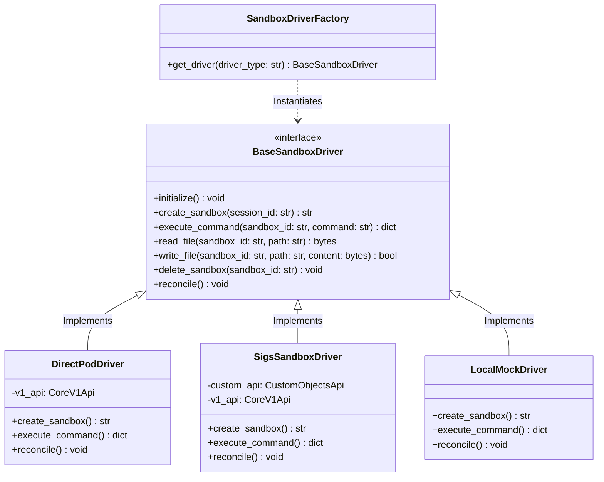

# Sandbox Driver Architecture: Supporting Dual Kubernetes Engines

To support both the **Direct Pod Engine** (zero-dependency, standard Kubernetes API) and the **SIGs Agent-Sandbox CRD Engine** (hardened, enterprise-grade, `kubernetes-sigs/agent-sandbox` controller), Outpost Managed Agents utilizes the **Provider/Adapter (Driver) Pattern**.

This decouples the agent orchestration loop from the low-level container scheduling mechanism.

---

## 1. Class Diagram & Core Interface

We define an abstract base class `BaseSandboxDriver` that exposes unified endpoints for lifecycle, file transfer, and remote command execution.



---

## 2. Driver Engine Implementations

### 2.1 Direct Pod Driver (`direct`)
*   **Behavior**: Creates standard Kubernetes `V1Pod` objects directly.
*   **Warm Pool**: Managed in the background by Outpost's internal scheduler loop (spawning/labeling Pods).
*   **Target**: Local development (`kind`/`minikube`) and clusters without CRD installation privileges.

### 2.2 SIGs Sandbox Driver (`sigs-sandbox`)
*   **Behavior**: Instead of creating a Pod, it submits a `SandboxClaim` Custom Resource (CR) to the Kubernetes API:
    ```yaml
    apiVersion: apps.kubernetes.io/v1alpha1
    kind: SandboxClaim
    metadata:
      name: claim-session-123
    spec:
      sandboxTemplateRef:
        name: default-agent-template
    ```
*   **Warm Pool**: Delegates pool management completely to the `agent-sandbox` controller. It blocks until the controller binds a pre-warmed pod to the `SandboxClaim`.
*   **Target**: Production enterprise clusters requiring strict security configurations (gVisor/Kata) and optimal cluster-level resource utilization.

### 2.3 Local Mock Driver (`mock`)
*   **Behavior**: Simulates commands and files locally (or in Docker).
*   **Target**: Local development where Kubernetes is completely unavailable.

---

## 3. Implementation Code Structure

The abstract base class interface is defined as follows:

```python
# app/services/sandbox/base.py
import abc
from typing import Dict, Any

class BaseSandboxDriver(abc.ABC):
    @abc.abstractmethod
    async def initialize(self) -> None:
        """Initializes API clients and validates cluster availability."""
        pass

    @abc.abstractmethod
    async def create_sandbox(self, session_id: str) -> str:
        """Provisions a sandbox and returns the active Pod identifier."""
        pass

    @abc.abstractmethod
    async def execute_command(self, sandbox_id: str, command: str) -> Dict[str, str]:
        """Executes a bash command and returns stdout, stderr, and exit_code."""
        pass

    @abc.abstractmethod
    async def read_file(self, sandbox_id: str, path: str) -> bytes:
        """Reads files from the sandbox workspace."""
        pass

    @abc.abstractmethod
    async def write_file(self, sandbox_id: str, path: str, content: bytes) -> bool:
        """Writes files into the sandbox workspace."""
        pass

    @abc.abstractmethod
    async def delete_sandbox(self, sandbox_id: str) -> None:
        """Terminates the sandbox and frees underlying resources."""
        pass

    @abc.abstractmethod
    async def reconcile(self) -> None:
        """Triggered periodically to perform pool cleanup/synchronization."""
        pass
```

### Driver Factory Resolution
We resolve the driver at startup using configurations from the `Settings` class:

```python
# app/services/sandbox/factory.py
from app.config import settings
from app.services.sandbox.base import BaseSandboxDriver
from app.services.sandbox.direct import DirectPodDriver
from app.services.sandbox.sigs import SigsSandboxDriver
from app.services.sandbox.mock import LocalMockDriver

class SandboxDriverFactory:
    @staticmethod
    def get_driver() -> BaseSandboxDriver:
        driver_type = settings.SANDBOX_DRIVER.lower()
        if driver_type == "direct":
            return DirectPodDriver()
        elif driver_type == "sigs-sandbox":
            return SigsSandboxDriver()
        elif driver_type == "mock":
            return LocalMockDriver()
        else:
            raise ValueError(f"Unsupported sandbox driver type: {driver_type}")

# Global driver singleton
sandbox_driver = SandboxDriverFactory.get_driver()
```

---

## 4. Architectural Benefits

1.  **Orchestrator Decoupling**: The `AgentOrchestrator` reasoning loop never has to know how containers are scheduled or managed. It simply executes `sandbox_driver.execute_command(session.pod_name, cmd)`.
2.  **Infrastructure Flexibility**: Moving from local development (using the `mock` or `direct` driver) to multi-tenant production (`sigs-sandbox`) requires only a single environment variable change:
    `SANDBOX_DRIVER=sigs-sandbox`
3.  **Extensibility**: If a user wants to run execution sandboxes in **AWS ECS Fargate** or **Docker Compose** instead of Kubernetes, they can easily write a new `FargateDriver` implementing `BaseSandboxDriver` without touching the core API code.
